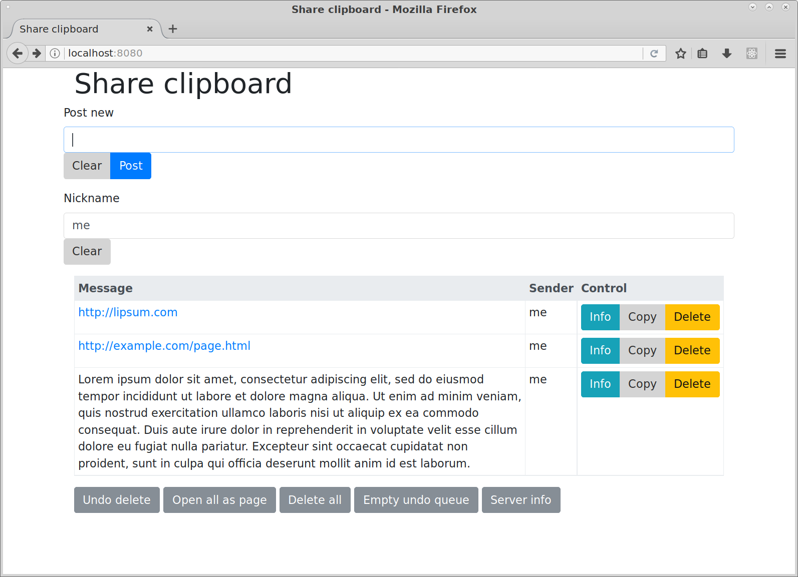

Shareclip README
================

Introduction
------------

Shareclip is a web server for sharing entries between users, typically on a local network. Everyone accessing the site sees the same list of shared entries.

Screenshots
-----------

Features
--------

- Many clients can simultaneously connect to the shared clipboard server
- New posts or deletions are instantly propagated to all clients
- Post plain text or URL messages
- Messages are stored with a timestamp and nickname of the poster
- Posts consisting of URLs are detected and displayed as HTML links
- Copy a message to the user's desktop clipboard with a button
- Option to open all messages as a simple webpage
- Server state is stored in a persistent statefile between runs
- Delete and undo delete messages
- Uses Websocket technology to push updates to browsers

Quick start
-----------

This section only applies to computers running Linux with a fairly up-to-date installation.

1. Make sure you have :code:`python3` installed using your distribution package manager or other method.

2. Download the project source code

.. code:: bash

    git clone http://github.com/mjem/shareclip.git
    cd shareclip.git

3. The project needs a few addon libraries. The simplest way to install these as a local user is to run:

.. code:: bash

    virtualenv --python=python3 env
    . env/bin/activate
    pip install -r requirements.txt

4. Run the web server. It defaults to port 8080:

.. code:: bash

    bin/shareclip --serve

5. Open a web browser to http://localhost:8080

Installation
------------

The project includes a :code:`setup.py` file to permanently install it in your python3 installation.

Commands
--------

The project has a single command line entry command. Run :code:`shareclip --help` to see available options.

Statefile
---------

By default when the server shuts down the state is recorded to :code:`~/.local/share/shareclip/state`. The same file is automatically read on startup. Use the :code:`--clear-state` option to permanently delete any existing statefile on startup.

Use the :code:`--statefile` option to chose a different statefile.

Alternatively, according to the XDG_ Freedesktop specification, set the :code:`$XDG_DATA_HOME` directory to an alternative location where the statefile `shareclip/state` will be created.

.. _XDG: https://specifications.freedesktop.org/basedir-spec/basedir-spec-latest.html

Server
------

Use the :code:`--port` and :code:`--prefix` options to control the URL to access the web server on.

Third party libraries
---------------------

https://daneden.github.io/animate.css/
https://github.com/daneden/animate.css

http://rmodal.js.org/
https://github.com/zewish/rmodal.js

bootstrap 4

the icon

License
-------

Released under the GPLv3_ license.

.. _GPLv3: LICENSE.rst

Copyright
---------

Shareclip is copyright 2017 Mike Elson <mike.elson@gmail.com>
